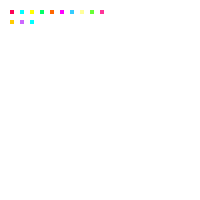
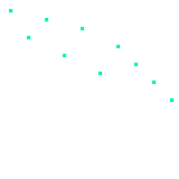
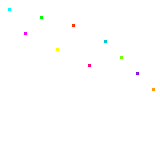

<!-- Profile Banner -->
<!-- 

  

   -->
<!-- 

  

  

 -->

  

<!-- 

  

 -->
<!--  -->

<!-- 

  🚀 Full-stack Developer | ❤️ JavaScript & C# | 🌍 Based in Sweden

---

### 🛠 Tech Stack

- ⚙️ Backend: C#, ASP.NET Core, EF Core, SQL
- 🖥 Frontend: React, JavaScript, MUI, Vite
- 🐳 DevOps: Docker, GitHub Actions
- 🧪 Testing: xUnit, FluentAssertions, Integration Tests

---
 -->
